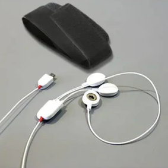
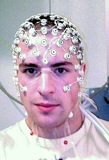

# Transplant (2022)
### Une oeuvre de Nora Gibson
  
*[Son site web](https://www.noragibsonvisualist.com/)*

### Première Présentation: Du 15 au 29 août 2024  
  
Cette installation faisant partie du parcours de 23 installations du village numérique par MUTEK  
Présentée aux Condos Laurent et Clark au Quartier des spectacles  
*Adresse : 1 Blvd. De Maisonneuve Ouest, Montréal, H2X 0E3*

## Qu'est-ce que c'est?

Transplant est une installation qui utilise des ondes cérébrales et les mouvements de ceux qui interagissent avec l'installation pour générer des visuels et des sons.  

**[Voici un exemple](https://vimeo.com/770426091)**

Les visuels en question représentent ce qui se passe dans le cerveau et symbolisent une fusion entre l'humain et l technologie.

Cette oeuvre est un commentaire sur la séparation entre la technologie et la créativité humaine.

### Comment interagit-on avec cette ouvre?

Pour interagir avec cette oeuvre, il ne faut que mettre le capteur EEG qui va être à votre disposition et se placer devant le capteur Kinect

*examples de capteurs EEG:*  

## Ce qui rend cette oeuvre unique?

**L'intégration des ondes cérébrales dans l'oeuvre.**

### Technoligies utilisées

**Pour la construction de l'installation**
- Structure en métal
- Toile

**Pour la réalisation de l'oeuvre**
- Ordinateur
- Projecteur
- Lumières LED
- Capteur EEG (Électroencéphalographie)
- Capteur Kinect
- Logiciel TouchDesigner

### Apréciation

J'apprécie le message de l'oeuvre, ce qu'elle tente d'accomplir, je trouve aussis que l'utilisation des ondes cérébrales très ingénieuse et originale, j'aurais bien aimé la voir en action.

*documentation par Samuel Desmeules-Voyer*
