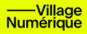

# Transplant (2022)
### Une oeuvre de Nora Gibson

### Première Présentation: Du 15 au 29 août 2024
  
Cette installation faisant partie du parcours de 23 installations du village numérique par MUTEK  
Présentée aux Condos Laurent et Clark au Quartier des spectacles  
*Adresse : 1 Blvd. De Maisonneuve Ouest, Montréal, H2X 0E3*

## Qu'est-ce que c'est?

Transplant est une installation qui utilise des ondes cérébrales et les mouvements de ceux qui interagissent avec l'installation pour générer des visuels et des sons  
[Voici un exemple](https://vimeo.com/770426091)

Les visuels en question, représentés sous la forme d'un réseau ou d'une toile d'araigné dansante servent de visualisation de se qui se passe dans le cerveau mais aussi de métaphore symbolisant comment le corps et l'esprit interagissent, l'effet que l'esprit peut avoir sur le monde réel. Pour renforcer cette idée de la fusion entre le corps et l'esprit et ajouter un touche de personalisation à l'oeuvre, les sphères du réseau sont texturées avec une vidéo de l'artiste qui fait son activité préférée; danser.

C'est une installation interessante pour tous ceux qui s'intéressent à la question de comment on peut faire intéragire la technologie avec l'esprit humain de manière plus personelle et créative dans une ère où l'intelligence artificielle semble être en train de tuer la créativité.

[Description générale] + [Lieu et date de présentation initiale] + [Autres lieux de présentation]

[objectif de l'oeuvre + public cible] + (peut etre aussi le contexte géographique et culturel si c'est utile)

## Comment interagit-on avec cette ouvre?

Pour interagire avec cette oeuvre il faut mettre le

## Ce qui rend cette oeuvre unique

L'utilisation des ondes thêta émises par le cerveau de l'utilisateur pour en faire un oeuvre extrêmement personnelle fait en sorte d'envoyer un message très positif et optimiste par rapport à la technologie moderne, ce qui n'est pas commun du tout en se momment, ça crée un expérience très positive et personnelle de la technologie.

### Technoligies utilisées

**Pour la construction de l'installation**
- Structure en métal
- Toile

**Pour la réalisation de l'oeuvre**
- Ordinateur
- Projecteur
- Lumières LED
- Capteur EEG (Électroencéphalographie)
- Capteur Kinect
- Logiciel TouchDesigner

[son fonctionnement et l'impact qu'elle a sur l'oeuvre]

[les technologies utilisées, les supports ou les médiums exploités + détails sur la manière dont l'œuvre a été développée]

## Apréciation

*documentation par Samuel Desmeules-Voyer*
